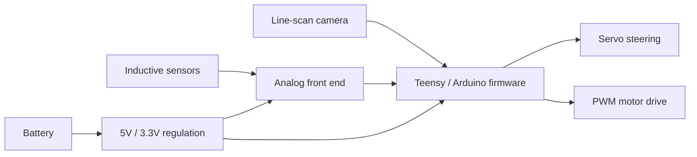

# IEEE NATCAR Autonomous Race Car

An autonomous electric race car built for the IEEE NATCAR competition. The project combines embedded firmware, custom PCB design, optical sensing, inductive sensing, motor control, and real-time steering control on a modified RC car platform.

The vehicle follows a track using a 128-pixel line-scan camera and explored sensor fusion with three inductive pickups. The final firmware reads the camera, estimates the track line position, applies PD-style steering control, and adjusts motor PWM based on how aggressively the car needs to turn.

## Project Highlights

- Built and tuned an autonomous race car for IEEE NATCAR
- Implemented real-time line following in Arduino-style C/C++
- Used a TSL1401-style 128-pixel line-scan camera for track detection
- Designed around a custom Teensy 3.1-compatible controller PCB
- Integrated left, center, and right inductive sensors through analog front-end circuitry
- Controlled steering with a servo and propulsion with dual PWM motor outputs
- Iterated through multiple firmware versions during testing and tuning

## How It Works



At runtime, the controller:

1. Clocks the line-scan camera and reads 128 analog pixel values.
2. Finds the strongest rising and falling edges in the camera data.
3. Estimates the line midpoint relative to a calibrated camera center.
4. Converts the line offset into a steering angle.
5. Reduces speed during sharper turns.
6. Writes servo and motor PWM commands.

More detail is available in [System Overview](docs/system-overview.md) and [Control Algorithm](docs/control-algorithm.md).

## Repository Structure

```text
NATCAR/
  README.md
  firmware/
    natcar_final/
      natcar_final.ino
    archive/
      natcar_v1.1.ino
      natcar_v1.2.ino
      natcar_v1.3.ino
      natcar_v1.4.ino
      natcar_v1.5.ino
      natcar_v1.6.ino
      natcar_v1.8.ino
      natcar_v1.9.ino
  hardware/
    Natcar 1.01.sch
    Natcar 1.01.brd
  docs/
    system-overview.md
    control-algorithm.md
    hardware.md
    calibration.md
    firmware-history.md
  data/
    inductor_measurement.xlsx
    inductor scaling.xlsx
  references/
    28317-TSL1401-DB-Manual.pdf
  images/
    control-loop.png
    hardware-pin-map.png
    system-architecture.png
```

## Documentation

- [System Overview](docs/system-overview.md): full vehicle architecture and subsystem summary
- [Control Algorithm](docs/control-algorithm.md): camera processing, steering control, speed control, and earlier sensor-fusion logic
- [Hardware](docs/hardware.md): PCB, major components, power, motor drive, and pin mapping
- [Calibration](docs/calibration.md): inductor measurement and scaling notes
- [Firmware History](docs/firmware-history.md): what changed across the archived firmware versions

## Hardware Summary

| Area | Description |
| --- | --- |
| Chassis | Custom-modified RC car platform |
| Controller | Teensy 3.1-compatible Arduino-style firmware target |
| Optical sensor | 128-pixel line-scan camera |
| Inductive sensors | Left, center, and right pickups for guide detection |
| Actuators | Steering servo and left/right motor outputs |
| PCB | Custom Eagle schematic and board files |
| Power | Battery input with onboard 5V and 3.3V regulation |

## Firmware Summary

The final sketch lives at:

```text
firmware/natcar_final/natcar_final.ino
```

Key control constants in the final firmware:

| Parameter | Value | Purpose |
| --- | ---: | --- |
| `TOP_SPEED_PWM` | `100` | Base motor PWM target |
| `STEERING_KP` | `0.6` | Steering proportional gain |
| `STEERING_KD` | `0.6` | Steering derivative gain |
| `CAMERA_CENTER_PIXEL` | `58` | Calibrated camera center |
| `LINE_BRIGHTNESS_THRESHOLD` | `200` | Minimum midpoint brightness for a valid line |
| `MIN_EDGE_STRENGTH` | `25` | Minimum rising/falling edge contrast for a valid line |
| `SERVO_CENTER` | `45` | Servo center |
| `SERVO_RANGE` | `25` | Servo command clamp |
| `MAX_LOST_LINE_FRAMES` | `25` | Frames before fail-safe motor stop |

Archived sketches are kept in `firmware/archive/` to show the development process, including earlier camera-plus-inductor fusion attempts.

## Development Notes

This project was built collaboratively by a four-person team. Work included hardware wiring, PCB design, sensor integration, real-time control firmware, serial debugging, calibration, and track testing.

The repository is organized as a showcase of the complete embedded design cycle rather than a packaged library. The hardware files require Eagle-compatible tooling, and the final firmware is intended for an Arduino/Teensyduino-style environment with the Servo library available.

## License

This project is licensed under the Apache License 2.0. See [LICENSE](LICENSE) for details.
