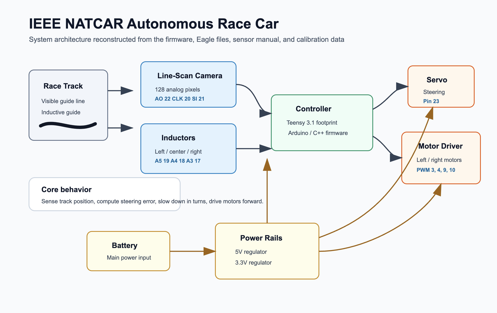

# Computer Systems Lab

[](LICENSE)
[](https://en.cppreference.com/w/cpp/17)
[](hardware/verilog-mini-cpu)
[](https://www.freertos.org/)
[](robotics/natcar-autonomous-vehicle)

A collection of systems-level projects spanning instruction set architecture,
real-time operating systems, digital hardware design, and embedded robotics.
Each project is self-contained and explores a different layer of the computing
stack — from silicon-level HDL up through real-time firmware running on
physical hardware. Read together, the four projects trace the boundary this
repo is named for: the point where software's abstractions — instructions,
tasks, control loops — meet the hardware that actually executes them. See
[How the Four Projects Relate](#how-the-four-projects-relate) for the full
thread connecting them.

## Projects

| Project | Area | Language / Tools | Description |
| --- | --- | --- | --- |
| [riscv/isa-simulator](riscv/isa-simulator) | ISA Simulation | C++17, CMake | A lightweight RV32I simulator with a CLI, instruction decoder, byte-addressable memory model, and 42-test suite for exploring processor execution at the instruction level. |
| [rtos/freertos-task-scheduler](rtos/freertos-task-scheduler) | RTOS | C, FreeRTOS, POSIX | A POSIX-based FreeRTOS simulation of a smart embedded system demonstrating concurrent task scheduling, queue-based IPC, mutex-protected I/O, and runtime heap monitoring. |
| [hardware/verilog-mini-cpu](hardware/verilog-mini-cpu) | Digital Hardware | Verilog, Python, Icarus | An 8-bit pipelined CPU with a custom 16-opcode ISA, a 2-stage IF/EX-WB pipeline, a two-pass Python assembler, and a fully self-checking testbench suite. |
| [robotics/natcar-autonomous-vehicle](robotics/natcar-autonomous-vehicle) | Embedded Robotics | C/C++, Arduino/Teensy, Eagle | An autonomous race car for the IEEE NATCAR competition: custom PCB, 128-pixel line-scan camera sensing, PD steering control, and dual PWM motor drive. |

## Project Deep Dives

### RISC-V ISA Simulator ([`riscv/isa-simulator`](riscv/isa-simulator))

The simulator implements the full RV32I base integer ISA — arithmetic,
logical, shifts, loads, stores, branches, jumps, `lui`/`auipc`, and
`ecall`/`ebreak` — as pure architectural state transitions in C++17, with no
notion of gates, clocks, or pipeline stages at all. That's a deliberate choice,
not a limitation: an ISA simulator's job is to pin down *what* each
instruction must do to registers, memory, and the program counter,
independently of *how* any particular piece of hardware realizes it. The
decoder handles all six RV32I instruction formats (R/I/S/B/U/J) with explicit,
readable field extraction rather than table-driven cleverness, `x0` is
hardwired to zero at the register-file level (writes are silently dropped,
matching real RISC-V behavior), and the byte-addressable little-endian memory
model raises a clear, typed error on out-of-bounds access instead of silently
corrupting state — a debuggability property real hardware doesn't give you for
free. The `riscv-sim` CLI's three execution modes (full-run, `--trace`,
`--step`) and final register dump exist so a user can watch architectural
state evolve instruction-by-instruction, which is the entire pedagogical point
of building a simulator instead of just reading the spec. 42 unit and
integration tests validate the decoder against every instruction format, each
instruction's semantics individually (including signed/unsigned edge cases in
shifts and comparisons), and three example programs run end-to-end through the
CLI itself, not just through internal APIs.

### FreeRTOS Smart Task Scheduler ([`rtos/freertos-task-scheduler`](rtos/freertos-task-scheduler))

Six FreeRTOS tasks run concurrently on the POSIX simulator port, and the
priority assignments encode a real scheduling decision, not an arbitrary
default: the Logger task runs at priority 3 (highest), LED/Temperature/Motion
at priority 2, and Command/System-Monitor at priority 1. The logger owns every
heap-allocated log message once it's successfully enqueued and frees it after
printing — giving it the highest priority keeps that queue draining promptly
instead of letting heap-owned messages pile up behind lower-priority
producers, which would otherwise be a slow, silent heap leak under load. Three
typed queues (`ledCommandQueue`, `tempCommandQueue`, `loggerQueue`) carry
structured messages between tasks rather than raw bytes, and a single
`printMutex` serializes console output so six tasks writing concurrently never
interleave mid-line. A subtler design detail worth calling out: each
simulated-sensor task keeps its own task-local pseudo-random generator state
rather than sharing one global `rand()` call — a small thing, but it's exactly
the kind of shared-mutable-state bug that's easy to introduce and hard to
diagnose once several tasks are actually running concurrently on a real
scheduler instead of a single-threaded mental model.

### Verilog Mini CPU ([`hardware/verilog-mini-cpu`](hardware/verilog-mini-cpu))

This is the one project in the set with no simulator standing in for the
hardware — it's synthesizable RTL, and the pipeline hazard story is the most
interesting part of it. The 2-stage IF/EX-WB design is *hazard-free by
construction*, not by added forwarding or stalling logic: the register file
and data memory are synchronous-write/asynchronous-read, and because only one
instruction is ever resident in EX-WB at a time, instruction *i+1*'s register
reads in cycle *k+1* are guaranteed to see instruction *i*'s writeback that
committed at the clock edge ending cycle *k*. That structural guarantee is
what lets the design skip an entire class of pipeline hazard logic that a
deeper pipeline would require. Branch handling reuses the same trick for
control hazards: a single `redirect` signal, asserted by EX-WB on a taken
branch/jump/`RET`, simultaneously drives the PC mux *and* injects a NOP into
the pipeline register's input in the same cycle — no separate flush flag, no
extra state, a 1-cycle penalty by construction. The custom 16-opcode ISA
(4-bit ALU ops, immediate/branch/jump/load-store/system instruction classes)
is a smaller, hand-designed contrast to RV32I above it in this repo — small
enough that its full encoding fits in one README table, which is the point.
Every module (ALU, register file, data memory, full CPU) has its own
self-checking testbench, the two-pass Python assembler has 30 unit tests, and
`loop_sum.asm` (summing 1 through 10) is verified end-to-end against the
actual simulated hardware, not just the ISA's intended semantics.

### IEEE NATCAR Autonomous Race Car ([`robotics/natcar-autonomous-vehicle`](robotics/natcar-autonomous-vehicle))



NATCAR is the one project in this repo that isn't simulated or bench-tested in
isolation — it's a custom Eagle-designed PCB, a Teensy 3.1-compatible
controller, and a 128-pixel TSL1401 line-scan camera, built and tuned against
a physical track by a four-person team. The line-position estimator is a
compact edge detector: rather than thresholding the entire 128-pixel frame, it
finds the strongest rising and falling brightness transitions and averages
their positions, which is cheap enough to run every 10 ms loop iteration and
robust to lighting variation across a track. Steering is closed-loop PD
control on that position error; speed is reduced proportionally to how sharp
the turn is, and independently ramp-limited in both directions — one step per
loop coming back up after the line is reacquired, so the car doesn't snap from
a stop straight to top speed, and a 25-consecutive-lost-frame fail-safe cuts
both motors instead of driving blind. What makes the project worth reading
past the final firmware is the archive: nine iterations
(`firmware/archive/natcar_v1.1.ino` through `v1.9`) show the team starting
with three-way inductive-sensor fusion alongside the camera and progressively
simplifying down to the leaner, more reliable camera-only control loop that
shipped — a real record of an engineering team converging on what actually
worked on the track, not just the polished end state.

## How the Four Projects Relate

The four projects aren't grouped here by coincidence — each one sits at a
different point along the boundary this repo is named for, the point where
software's abstractions meet the hardware that actually executes them:

1. **`verilog-mini-cpu` is the hardware side made explicit.** Gates, a
   register file, and a pipeline register realize an instruction set directly
   in synthesizable RTL — there is no layer of software standing between the
   instruction encoding and the physical logic that executes it.
2. **`isa-simulator` is the contract one level up.** RV32I's architectural
   semantics — what `add` or `beq` must do to registers, memory, and the
   program counter — are pinned down independently of any specific gate-level
   realization. It's the same relationship the mini CPU has to its own
   16-opcode ISA, at industrial scale: an ISA is the interface both hardware
   designers and software toolchains build against, and this project models
   that interface directly rather than any one implementation of it.
3. **`freertos-task-scheduler` builds on top of that contract.** An RTOS
   assumes the ISA-level guarantees below it hold, and adds the next layer of
   abstraction software actually needs: concurrent tasks, queues, priorities,
   and scheduling — coordinating several pieces of software sharing one
   processor, the problem that doesn't exist yet at the single-instruction
   level the simulator models.
4. **`natcar-autonomous-vehicle` is where software reaches back out through
   that boundary.** A PD control loop reading a real camera and writing real
   PWM signals is software touching physical hardware at the other end of the
   stack — voltages and timing, not architectural state.

There's a second thread worth naming: three of the four projects are
simulate-and-verify-on-a-dev-machine by design (42 automated tests for the ISA
simulator, self-checking Verilog testbenches for every module, a POSIX
simulation of the RTOS with zero application warnings), while NATCAR is the
one project actually deployed against physical reality — and its firmware
archive is the record of what changed once simulation gave way to a real
track, real sensors, and real noise.

## Skills and Concepts Covered

| Layer | Concepts |
| --- | --- |
| Digital Logic / RTL | Verilog, pipelined datapath, hazard analysis, ALU design, synchronous vs. asynchronous read/write |
| Computer Architecture | RISC-V RV32I, instruction formats, decoding, register files, memory models, program loading |
| Systems Programming | C/C++17, CMake, memory layout, bit manipulation, signed/unsigned arithmetic |
| Real-Time Systems | FreeRTOS task scheduling, queues, mutexes, heap management, POSIX threading |
| Embedded Hardware | PCB design (Eagle), Teensy/Arduino, servo and motor PWM, analog sensor front ends |
| Verification & Testing | Unit tests, integration tests, self-checking testbenches, waveform capture (VCD/GTKWave) |
| Toolchain | Python assembler, CMake, GNU Make, Icarus Verilog, custom test harnesses |

## Repository Structure

```
computer-systems-lab/
├── README.md
├── riscv/
│   └── isa-simulator/          # RV32I simulator (C++17)
│       ├── include/riscv_sim/  # headers: decoder, cpu, memory, etc.
│       ├── src/                # implementation + riscv-sim CLI
│       ├── tests/              # 42-test suite
│       └── examples/           # flat binary programs
├── rtos/
│   └── freertos-task-scheduler/ # FreeRTOS POSIX simulation (C)
│       ├── include/
│       ├── src/                 # task implementations
│       └── docs/                # architecture + setup notes
├── hardware/
│   └── verilog-mini-cpu/        # 8-bit pipelined CPU (Verilog)
│       ├── src/                 # RTL modules
│       ├── tb/                  # testbenches
│       ├── tools/               # Python assembler
│       └── examples/            # assembly programs
└── robotics/
    └── natcar-autonomous-vehicle/ # IEEE NATCAR race car (C/C++)
        ├── firmware/              # final + archived sketches
        ├── hardware/              # Eagle schematic and board files
        ├── docs/                  # system overview, control, calibration
        └── data/                  # inductor measurement data
```

Each project keeps its own README, build instructions, and license in its
respective directory.

## Quick Start

Each project has its own build prerequisites; see the individual READMEs for
full setup instructions. At a glance:

```bash
# RISC-V ISA Simulator (requires CMake 3.16+ and a C++17 compiler)
cd riscv/isa-simulator
cmake -S . -B build -DCMAKE_BUILD_TYPE=Release && cmake --build build -j
./build/riscv_sim_tests                                # run 42 tests
./build/riscv-sim --trace examples/arithmetic/addi.bin # trace example

# FreeRTOS Task Scheduler (requires FreeRTOS kernel sources at ./FreeRTOS)
cd rtos/freertos-task-scheduler
make && ./freertos_sim

# Verilog Mini CPU (requires Icarus Verilog and Python 3)
cd hardware/verilog-mini-cpu
make test        # run all Verilog + assembler tests
make test-program  # assemble loop_sum.asm and simulate end-to-end

# NATCAR Firmware (requires Arduino IDE with Teensyduino)
# Open robotics/natcar-autonomous-vehicle/firmware/natcar_final/natcar_final.ino
```

## References

**RISC-V ISA Simulator**
- [RISC-V ISA Specification, Volume I: Unprivileged ISA](https://github.com/riscv/riscv-isa-manual/releases/latest) — the authoritative reference for RV32I instruction encodings and semantics.

**FreeRTOS Task Scheduler**
- [FreeRTOS Kernel](https://github.com/FreeRTOS/FreeRTOS-Kernel) — source of the RTOS kernel and POSIX simulator port used in this project.
- [FreeRTOS Reference Manual](https://www.freertos.org/Documentation/RTOS_book.html) — API reference for tasks, queues, mutexes, and timers.

**Verilog Mini CPU**
- [Icarus Verilog](https://steveicarus.github.io/iverilog/) — open-source Verilog simulator used for all testbenches.
- [GTKWave](https://gtkwave.sourceforge.net/) — waveform viewer for VCD output from the integration testbenches.

**IEEE NATCAR Autonomous Vehicle**
- [TSL1401-DB Line-Scan Camera Datasheet](robotics/natcar-autonomous-vehicle/references/28317-TSL1401-DB-Manual.pdf) — timing diagrams and electrical specs for the 128-pixel optical sensor.
- [IEEE NATCAR Competition](https://ieee.ucdavis.edu/natcar/) — competition rules and track specifications.

## License

This index repo is licensed under the MIT License — see [LICENSE](LICENSE).
Each subproject carries its own license in its own directory (the RISC-V ISA
simulator is MIT; the FreeRTOS task scheduler, Verilog mini CPU, and NATCAR
vehicle are each Apache License 2.0) — check the subproject's own `LICENSE`
file before reusing its code.
