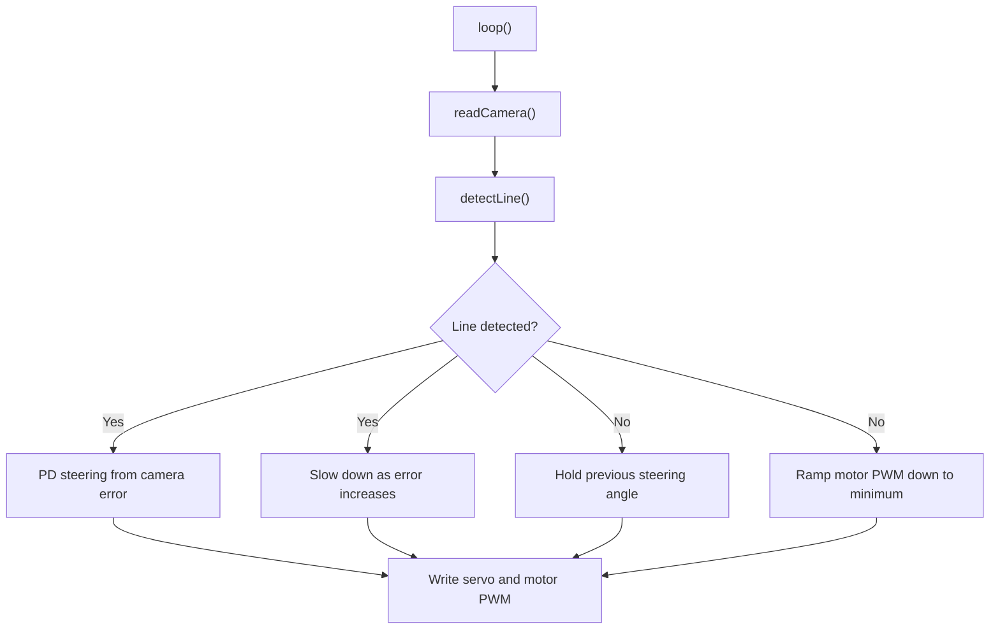

# Control Algorithm

The firmware is a real-time line-following controller. It reads the line-scan camera, estimates where the track line sits in the camera frame, then adjusts steering and speed based on that error.

## Final Firmware

The current showcase sketch is:

```text
firmware/natcar_final/natcar_final.ino
```

Important tuned constants:

| Parameter | Value | Meaning |
| --- | ---: | --- |
| `TOP_SPEED_PWM` | `100` | Base motor PWM target before turn slowdown |
| `STEERING_KP` | `0.6` | Steering proportional gain |
| `STEERING_KD` | `0.6` | Steering derivative gain |
| `SPEED_KP` | `1` | Speed proportional term |
| `SPEED_KD` | `0` | Speed derivative term |
| `SERVO_CENTER` | `45` | Servo center position |
| `SERVO_RANGE` | `25` | Steering clamp around center |
| `CAMERA_CENTER_PIXEL` | `58` | Calibrated camera midpoint |
| `LINE_BRIGHTNESS_THRESHOLD` | `200` | Minimum midpoint brightness for a valid line |
| `MIN_EDGE_STRENGTH` | `25` | Minimum edge contrast for a valid line |
| `MAX_LOST_LINE_FRAMES` | `25` | Frames before fail-safe motor stop |

## Camera Reading

The TSL1401-style line-scan camera is controlled with three pins:

| Firmware name | Pin | Purpose |
| --- | ---: | --- |
| `PIN_CAMERA_AO` | `22` | Analog pixel output |
| `PIN_CAMERA_CLK` | `20` | Camera clock |
| `PIN_CAMERA_SI` | `21` | Start integration signal |

For each frame, the firmware pulses `SI`, clocks the camera 128 times, and stores each `analogRead()` result in `pixels[128]`.

## Line Position Detection

The `detectLine()` function estimates the center of the bright line by finding the largest positive and negative pixel transitions:

1. Compare each adjacent pair of pixels.
2. Store the index of the strongest rising edge.
3. Store the index of the strongest falling edge.
4. Average those two edge positions to estimate the line midpoint.
5. Accept the reading only if the midpoint pixel is bright enough and both edges have enough contrast.
6. Convert the midpoint to an error with `currentLinePosition = midpoint - CAMERA_CENTER_PIXEL`.

This is a compact edge-based detector. It avoids needing to threshold the entire image and works well when the line appears as a bright band against a darker background.

## Steering Control

When the camera sees the line, the steering command is:

```cpp
steeringAngle = SERVO_CENTER
  - currentLinePosition * STEERING_KP
  - positionDelta * STEERING_KD;
```

That gives a proportional term based on current line offset and a derivative term based on how quickly the offset is changing. The result is clamped to:

```cpp
SERVO_CENTER - SERVO_RANGE <= steeringAngle <= SERVO_CENTER + SERVO_RANGE
```

With the current constants, the servo command is limited to `20` through `70`, centered at `45`.

## Speed Control

The motor command slows down as the camera error increases:

```cpp
targetPwm = TOP_SPEED_PWM - abs(currentLinePosition) * TURN_SLOWDOWN_GAIN;
```

The final sketch drives both sides with the same PWM value:

```cpp
rightMotorPwm = targetPwm;
```

When the camera loses the line, the firmware ramps both sides down toward a minimum PWM of `30`. If the line stays lost for `25` frames, the fail-safe sets both motor outputs to `0`.

## Control Flow



## Earlier Sensor Fusion Work

The archived firmware versions include helper functions such as `PosAFE()`, `lineDetectedAFE()`, `CalculateAngle()`, and `CalculateSpeed()`. These versions used left, center, and right inductor readings to estimate whether the guide reference was centered or offset and then selected steering angles accordingly.

That history is useful for showcasing the engineering process: the team explored a richer sensor-fusion design, then tuned toward the implementation that was most reliable on the physical car.
