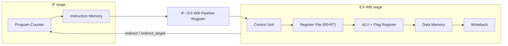

# Verilog Mini CPU

[](LICENSE)


An 8-bit pipelined CPU built from scratch in Verilog, with a 16-opcode instruction set, a 2-stage pipeline with branch-flush handling, a custom Python assembler, and a fully self-checking testbench suite. Small enough to read end to end in one sitting; real enough to demonstrate the core ideas behind hardware pipelining.

## Highlights

- **Custom ISA** — 16 ALU operations, immediate/branch/jump/load-store/system classes, all hand-designed with bit-exact field layouts.
- **Real pipelining** — a 2-stage IF / EX-WB pipeline with a redirect-driven flush mechanism, not just a single-cycle datapath.
- **Toolchain, not just RTL** — a two-pass Python assembler turns labeled mnemonics into `$readmemh`-ready machine code.
- **Verified, not just simulated** — every module (ALU, register file, data memory, full CPU, assembler, end-to-end program) has a self-checking automated test.

## Contents

- [Architecture](#architecture)
- [ISA v2](#isa-v2)
- [ALU Flags](#alu-flags)
- [Assembler](#assembler)
- [Example Program](#example-program)
- [Project Structure](#project-structure)
- [Building and Testing](#building-and-testing)

## Architecture



**2-stage pipeline: IF / EX-WB.** The pipeline register (`if_exwb_reg.v`) latches `{instruction[15:0], pc[7:0]}` each clock edge.

**1-cycle branch penalty.** When EX-WB detects a taken branch, jump, or `RET`, it asserts `redirect`. That same signal simultaneously updates the PC mux and injects a NOP into the pipeline register's input — no separate flush flag needed. The speculatively-fetched instruction is squashed before it can commit any state.

**Hazard-free by construction.** The register file and data memory are synchronous-write / asynchronous-read, and only one instruction is ever in EX-WB at a time. Instruction *i+1*'s register reads in cycle *k+1* always see instruction *i*'s writeback committed at the clock edge ending cycle *k*. No forwarding or stalling logic is required.

**HALT** sets a sticky `halted` output. While asserted, the PC and pipeline register hold and all writes are suppressed, giving testbenches a clean "program finished" signal.

## ISA v2

Every instruction is 16 bits. The top two bits select the instruction class.

### Class `00` — ALU-REG

```
[15:14] class=00  [13:10] alu_op  [9:7] dest  [6:4] src_a  [3:1] src_b  [0] unused
```

`dest <= src_a OP src_b`

| `alu_op` | Mnemonic | Operation |
|----------|----------|-----------|
| `0000` | `ADD`  | `a + b` |
| `0001` | `SUB`  | `a - b` |
| `0010` | `AND`  | `a & b` |
| `0011` | `OR`   | `a \| b` |
| `0100` | `XOR`  | `a ^ b` |
| `0101` | `SLL`  | `a << b[2:0]` |
| `0110` | `SRL`  | `a >> b[2:0]` |
| `0111` | `SLT`  | `1` if `a < b` (unsigned), else `0` |
| `1000` | `NOT`  | `~a` |
| `1001` | `NEG`  | `0 - a` |
| `1010` | `ROL`  | rotate-left `a` by `b[2:0]` |
| `1011` | `ROR`  | rotate-right `a` by `b[2:0]` |
| `1100` | `MUL`  | low byte of `a * b`; carry=1 if high byte is non-zero |
| `1101` | `NAND` | `~(a & b)` |
| `1110` | `INC`  | `a + 1` |
| `1111` | `DEC`  | `a - 1` |

Unary ops (`NOT NEG INC DEC`) encode `src_b = 0`; the assembler accepts either `OP Rd, Ra` or `OP Rd` (shorthand for `OP Rd, Rd`).

### Class `01` — ALU-IMM

```
[15:14] class=01  [13:11] subop  [10:8] dest  [7:0] imm8
```

`dest <= dest OP imm8` (or `dest <= imm8` for `LDI`)

| `subop` | Mnemonic | Operation |
|---------|----------|-----------|
| `000` | `LDI`  | `dest <= imm8` |
| `001` | `ADDI` | `dest <= dest + imm8` |
| `010` | `SUBI` | `dest <= dest - imm8` |
| `011` | `ANDI` | `dest <= dest & imm8` |
| `100` | `ORI`  | `dest <= dest \| imm8` |
| `101` | `XORI` | `dest <= dest ^ imm8` |
| `110` | `SLTI` | `dest <= 1` if `dest < imm8` (unsigned), else `0` |

Flags are latched after both class `00` and class `01` instructions.

### Class `10` — Branch

```
[15:14] class=10  [13:11] cond  [10:3] offset (signed 8-bit)  [2:0] unused
```

If the condition is met: `pc <= pc + offset`. Range: −128 to +127 (covers the full 256-word memory).

| `cond` | Mnemonic | Taken when |
|--------|----------|------------|
| `000` | `BEQ` | `zero` set |
| `001` | `BNE` | `zero` clear |
| `010` | `BLT` | `negative` set |
| `011` | `BGE` | `negative` clear |
| `100` | `BCS` | `carry` set |
| `101` | `BCC` | `carry` clear |
| `110` | `BVS` | `overflow` set |
| `111` | `BRA` | always |

### Class `11` — Jump / Memory / System

Dispatched by `instr[13:12]`:

**`00` JUMP**
```
[15:14]=11  [13:12]=00  [11:4] target (8-bit)  [3] link  [2:0] unused
```
`pc <= target`. If `link=1` (JAL): also `R7 <= pc + 1` before jumping.

**`01` LOAD**
```
[15:14]=11  [13:12]=01  [11:9] dest  [8:1] addr  [0] unused
```
`dest <= dmem[addr]`

**`10` STORE**
```
[15:14]=11  [13:12]=10  [11:9] src  [8:1] addr  [0] unused
```
`dmem[addr] <= src`

**`11` SYSTEM**
```
[15:14]=11  [13:12]=11  [11:10] sysop  [9:0] unused
```
| `sysop` | Mnemonic | Effect |
|---------|----------|--------|
| `00` | `NOP`  | no operation |
| `01` | `HALT` | set `halted`, freeze pipeline |
| `10` | `RET`  | `pc <= R7` |

## ALU Flags

Four flags are latched after every ALU instruction (class `00` and `01`):

| Flag | Meaning |
|------|---------|
| `zero` | result is `0x00` |
| `negative` | `result[7]` is set |
| `carry` | carry-out (ADD), borrow (SUB), shifted-out bit (SLL/SRL), or MUL overflow |
| `overflow` | signed overflow for ADD/SUB |

## Assembler

`tools/asm.py` is a two-pass assembler (Python stdlib only) targeting ISA v2.

```bash
python3 tools/asm.py input.asm output.hex
```

Output is `$readmemh`-compatible: one 4-digit hex word per line, address 0 first.

**Syntax:**
- One instruction or label per line; labels may share a line with an instruction (`loop: ADD R0, R0, R1`).
- Comments: `;` or `#` to end-of-line.
- Registers: `R0`–`R7` (case-insensitive).
- Immediates: decimal (`42`), hex (`0xFF`), or binary (`0b1010`). Negative values are accepted and wrapped to 8-bit unsigned.
- Branch operands: a label name (offset computed by assembler) or a literal signed integer. Range: −128 to 127.
- Jump/load/store address operands: a label name (absolute address) or a literal integer. Range: 0–255.

**Mnemonic reference:**

| Class | Syntax | Description |
|-------|--------|-------------|
| ALU-REG (binary) | `OP Rd, Ra, Rb` | `ADD SUB AND OR XOR SLL SRL SLT ROL ROR MUL NAND` |
| ALU-REG (unary) | `OP Rd, Ra` or `OP Rd` | `NOT NEG INC DEC` |
| ALU-IMM | `OP Rd, imm8` | `LDI ADDI SUBI ANDI ORI XORI SLTI` |
| Branch | `OP label` or `OP offset` | `BEQ BNE BLT BGE BCS BCC BVS BRA` |
| Jump | `JMP target` / `JAL target` | unconditional jump; JAL saves return address in R7 |
| Load | `LD Rd, addr` | load from data memory |
| Store | `ST Rs, addr` | store to data memory |
| System | `NOP` / `HALT` / `RET` | no-op / halt / return via R7 |

## Example Program

`examples/loop_sum.asm` sums 1 + 2 + ... + 10 into R0, exercising the loop/branch-flush path end to end:

```asm
; loop_sum.asm — sum 1 + 2 + ... + 10 into R0
;   R0  running total
;   R1  loop counter (counts down 10 → 0)

        LDI  R0, 0      ; R0 = 0
        LDI  R1, 10     ; R1 = 10
loop:
        ADD  R0, R0, R1 ; R0 += R1
        SUBI R1, 1      ; R1--  (sets Z when R1 reaches 0)
        BNE  loop       ; repeat while R1 != 0
        HALT
```

Assembled hex:

```
4000    ; LDI  R0, 0
410a    ; LDI  R1, 10
0002    ; ADD  R0, R0, R1
5101    ; SUBI R1, 1
8ff0    ; BNE  loop  (offset = -2)
f400    ; HALT
```

Expected result after HALT: R0 = 0x37 (55), R1 = 0x00.

## Project Structure

```
.
├── src/
│   ├── alu.v                  8-bit ALU, 16 operations
│   ├── register_file.v        8 × 8-bit register file (R0–R7)
│   ├── instruction_memory.v   256 × 16-bit instruction memory
│   ├── data_memory.v          256 × 8-bit data memory
│   ├── control_unit.v         instruction decode and field extraction
│   ├── if_exwb_reg.v          IF/EX-WB pipeline register
│   └── top.v                  top-level CPU (IF + EX-WB stages)
├── tb/
│   ├── alu_tb.v               ALU unit test
│   ├── register_file_tb.v     register file unit test
│   ├── data_memory_tb.v       data memory unit test
│   ├── top_tb.v               full-CPU integration test (instruction-by-instruction)
│   └── top_program_tb.v       end-to-end program test (loads loop_sum.hex, checks result)
├── tools/
│   ├── asm.py                 two-pass assembler
│   └── test_asm.py            assembler unit tests (30 cases)
├── examples/
│   └── loop_sum.asm           example program
├── Makefile
└── LICENSE
```

## Building and Testing

### Prerequisites

- [Icarus Verilog](https://steveicarus.github.io/iverilog/) (`iverilog`, `vvp`)
- Python 3 (stdlib only — no packages required)
- [GTKWave](https://gtkwave.sourceforge.net/) for optional waveform inspection

### Run all tests

```bash
make test
```

Expected output:

```
alu_tb: PASS
register_file_tb: PASS
data_memory_tb: PASS
top_tb: PASS
..............................
----------------------------------------------------------------------
Ran 30 tests in 0.001s

OK
top_program_tb: PASS
```

### Run individual targets

```bash
make test-alu            # ALU unit test
make test-register-file  # register file unit test
make test-data-memory    # data memory unit test
make test-top            # full integration test (step-by-step)
make test-asm            # assembler unit tests (Python)
make test-program        # end-to-end: assemble + simulate loop_sum
```

### Assemble a program manually

```bash
python3 tools/asm.py examples/loop_sum.asm examples/loop_sum.hex
```

### View waveforms

The integration testbench writes `waveform.vcd`; the program testbench writes `waveform_program.vcd`.

```bash
make test-top
gtkwave waveform.vcd
```

### Clean generated files

```bash
make clean
```

## License

Licensed under Apache-2.0. See [LICENSE](LICENSE).
