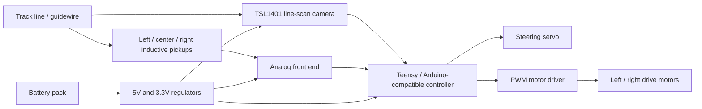

# System Overview

This project is an autonomous electric race car built for the IEEE NATCAR competition. The car follows a track using a 128-pixel line-scan camera, three inductive sensors, a custom controller board, PWM motor drive, and servo steering.

The design goal was to close the full embedded systems loop: sense the track, estimate the car's lateral position, compute steering and speed commands, and actuate the vehicle in real time.

## High-Level Architecture

## Main Subsystems

| Subsystem | Role | Repository files |
| --- | --- | --- |
| Firmware | Reads sensors and controls steering/motor PWM | `firmware/natcar_final/natcar_final.ino` |
| Archived firmware | Earlier experiments and tuning passes | `firmware/archive/` |
| Custom PCB | Motor drive, power regulation, sensor front end, connectors | `hardware/Natcar 1.01.sch`, `hardware/Natcar 1.01.brd` |
| Camera reference | Datasheet/manual for the TSL1401 line-scan camera board | `references/28317-TSL1401-DB-Manual.pdf` |
| Calibration data | Inductor measurements and scaling curves | `data/` |

## Runtime Loop

The final firmware repeats a short control loop:

1. Clock the line-scan camera and read 128 analog pixel values.
2. Find the strongest bright-line edges in the pixel array.
3. Estimate the line midpoint relative to the calibrated camera center.
4. Convert line error into a steering servo command.
5. Reduce motor speed when the line error grows.
6. Write PWM outputs for the drive motors.

The loop delay is set to `10 ms`, so the controller is intended to respond quickly enough for a small race car moving at speed.

## Sensor Strategy

The project explored two complementary sensing modes:

- The line-scan camera detects the visible track line and provides a high-resolution lateral error.
- The inductive pickups detect the electromagnetic/metal guide reference and can help when optical readings become unreliable.

The archived sketches show more explicit camera-plus-inductor fusion. The final sketch keeps the camera path-following loop leaner, likely reflecting what worked most reliably during tuning.
