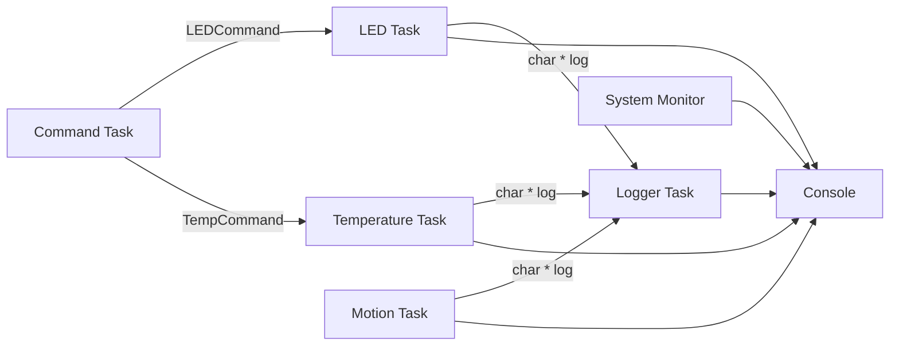

# Architecture

This simulation models a small embedded system as a set of FreeRTOS tasks that communicate through queues. Hardware behavior is represented with console output and randomized sensor values so the scheduler behavior can be observed on a desktop machine.

## Runtime Flow

## Shared Resources

- `ledCommandQueue`: receives typed `LEDCommand` messages for LED on/off and blink-period changes.
- `tempCommandQueue`: receives `TempCommand` messages that update the warning threshold.
- `loggerQueue`: receives dynamically allocated log strings. The logger owns and frees each message after printing it.
- `printMutex`: serializes console output so messages from different tasks do not overlap.

## Design Notes

- The command task acts as a deterministic stand-in for a user interface or serial command parser.
- Sensor data is simulated with pseudo-random values to exercise the scheduler and logging path.
- Simulation tasks use task-local pseudo-random state so one task cannot disturb another task's generated sensor sequence.
- Log producers call `send_log()`, which formats heap-owned messages and frees them if enqueueing fails. The logger owns each message after a successful queue send.
- The system monitor uses FreeRTOS runtime stats and heap APIs, which require matching options in `include/FreeRTOSConfig.h`.
